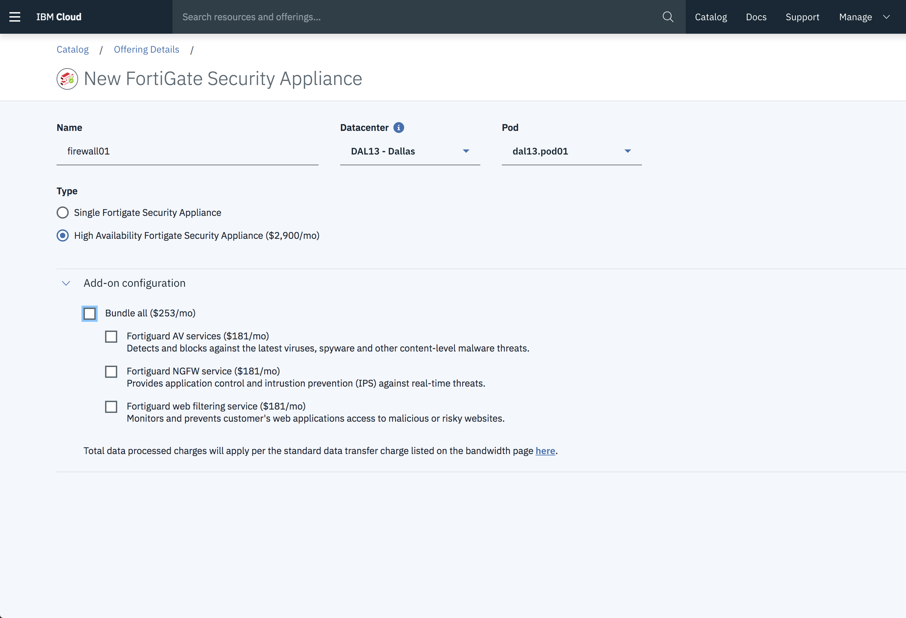

---

copyright:
  years: 2017
lastupdated: "2018-11-10"

---

{:shortdesc: .shortdesc}
{:new_window: target="_blank"}
{:codeblock: .codeblock}
{:pre: .pre}
{:screen: .screen}
{:tip: .tip}
{:download: .download}

# Getting started with Fortigate Security Appliance 10Gbps

The FortiGate Security Appliance 10Gbps is a hardware firewall that can be configured to protect traffic on multiple VLANs for both public and private networks. In the Customer Portal it is referred to as a “Multi VLAN Firewall”.
{:shortdesc}

## Ordering the FSA 10Gbps

Navigate to the order page in the customer portal:

1. From your browser, open the [customer portal ](https://control.softlayer.com/){:new_window} and log into your account.
2. In the Customer Portal navigation, select **Security > Network Security > Firewalls**.
3. From the Firewalls page, select the **Order Multi VLAN Firewall** link in the top right corner. This link opens the Multi VLAN Firewall order page.

From the Multi VLAN Firewall order page, you can order your FSA 10Gbps firewall.

1. Give the firewall a name.
2. Select the desired Datacenter and Pod from the dropdown menus. Availability is limited to select locations.
3. Choose to have a single FSA or enable failover protection with the High Availability option.
4. Choose from the list of Add-ons or bundle all of them together for a discounted price. The Order Summary box displays the updated information for your current order.

	

5. Select the Master Service Agreement checkbox once you review your order.
6. Submit your order by clicking **Place Order**.